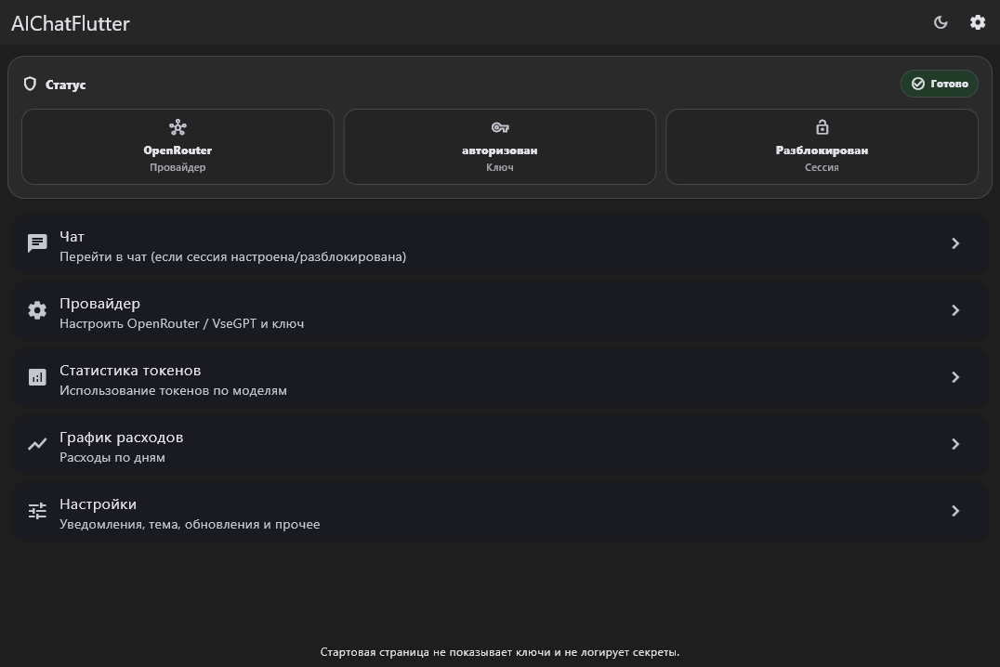
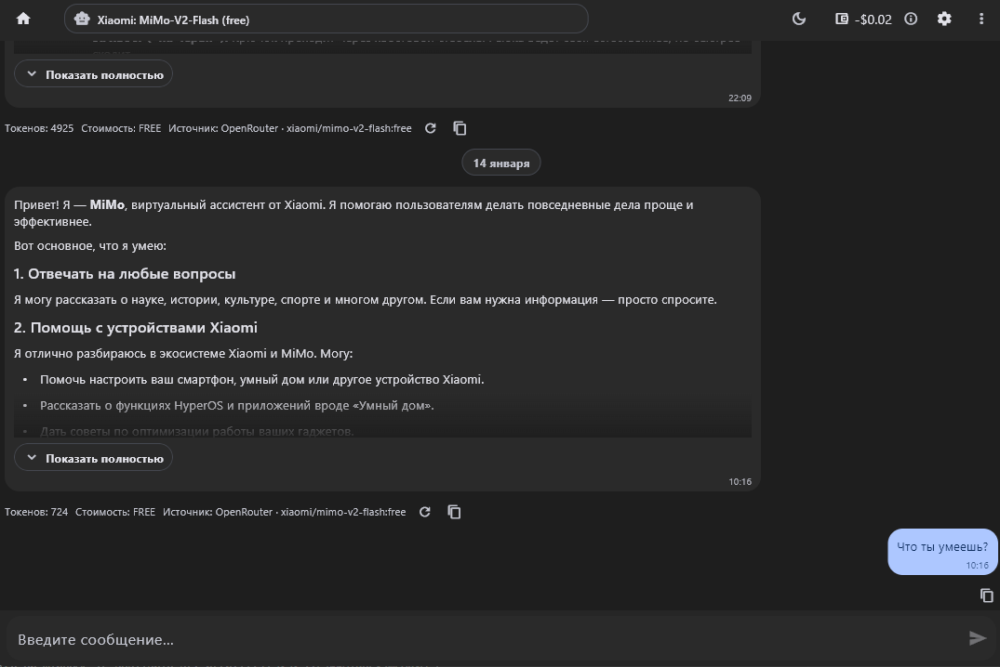
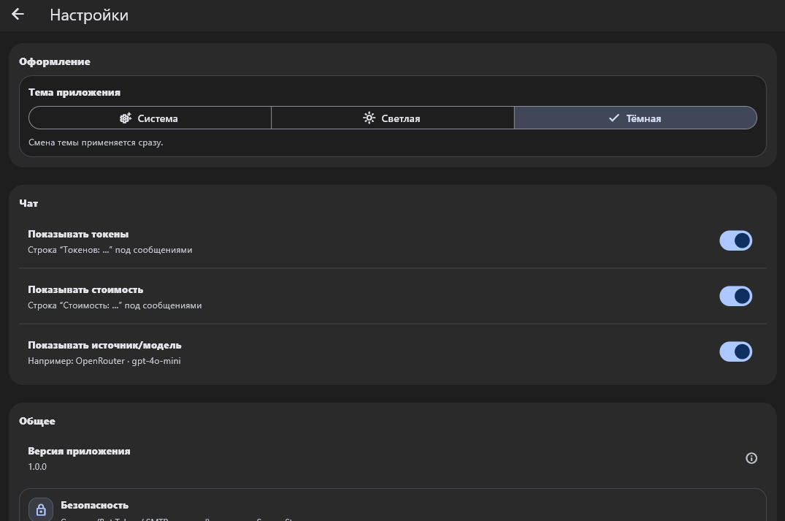
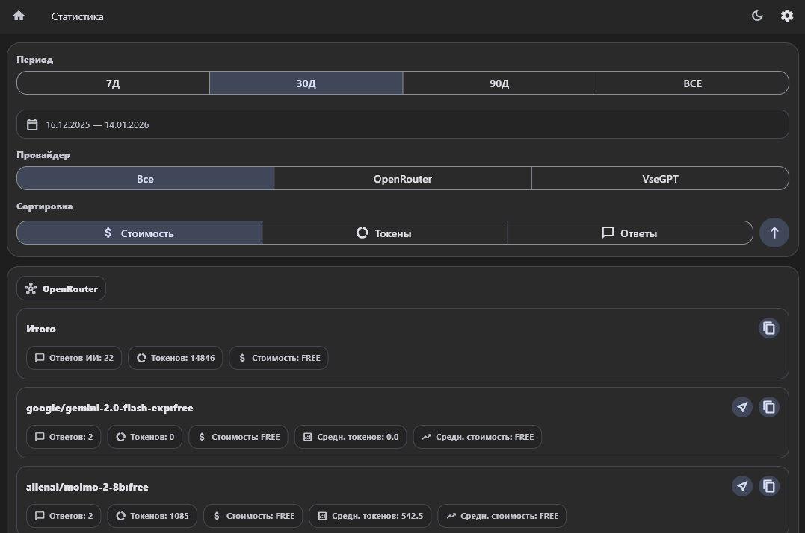
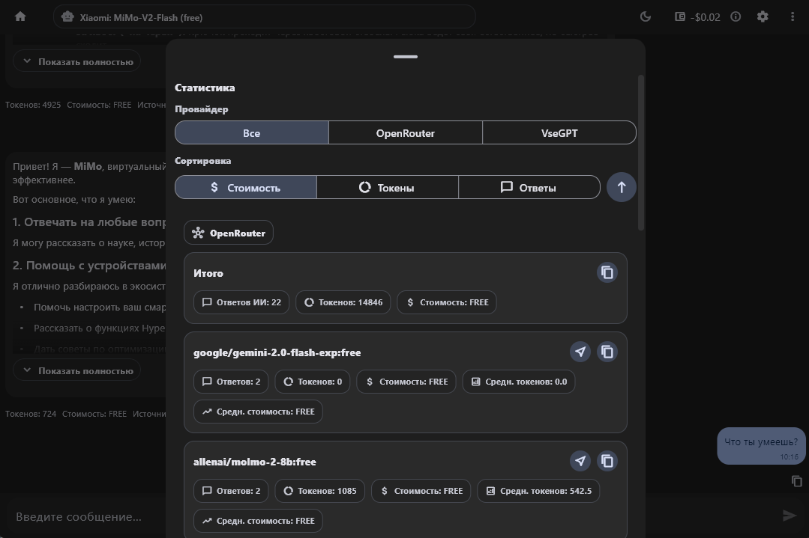
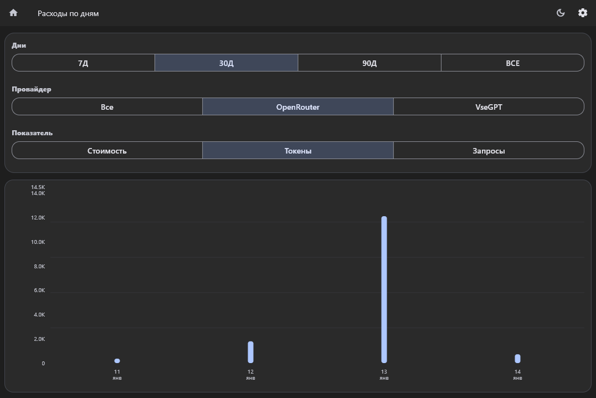

# AI Chat Flutter

Мощное кроссплатформенное приложение для общения с искусственным интеллектом через OpenRouter.ai и VseGPT.ru. Поддерживает работу с различными языковыми моделями, включая GPT-4, Claude, Gemini и другие.


## 📸 Скриншоты

### Главный экран


### Экран чата


### Настройки


### Аналитика


### Аналитика в чате


### График расходов


## ✨ Основные возможности

### 💬 Чат с AI
- Общение с различными языковыми моделями (GPT-4, Claude, Gemini и др.)
- Поддержка streaming-ответов в реальном времени (SSE)
- История сообщений с сохранением в локальной БД
- Повторная генерация ответов (regenerate)
- Отмена генерации в процессе

### 📝 Форматирование
- **Markdown**: полная поддержка markdown-разметки
  - Заголовки, списки, цитаты
  - Ссылки и изображения
  - Жирный и курсивный текст
- **Подсветка синтаксиса**: код с подсветкой для популярных языков
  - Dart, Python, JavaScript, JSON
  - Bash, YAML, XML/HTML, CSS, SQL
- **LaTeX формулы**: поддержка математических формул
  - Инлайн формулы: $x^2 + y^2 = z^2$
  - Блочные формулы с возможностью копирования
  - Автоматическое преобразование Unicode-математики

### 📊 Аналитика и статистика
- Статистика использования по моделям
- График расходов по дням
- Отслеживание токенов и стоимости
- Фильтрация по провайдерам и моделям
- Экспорт данных

### 🔔 Уведомления
- Telegram-уведомления о завершении ответов
- Email-уведомления через SMTP
- Настройка параметров уведомлений
- Тестирование подключений

### 🎨 Интерфейс
- Темная и светлая тема
- Адаптивный дизайн для разных экранов
- Интерактивное обучение (onboarding)
- Плавные анимации и переходы

### 🔐 Безопасность
- Шифрование API-ключей в Secure Storage
- PIN-код для защиты доступа
- Безопасное хранение паролей SMTP

## 🏗️ Архитектура проекта

### Структура директорий

```
lib/
├── api/                              # API клиенты
│   ├── ai_chat_client.dart           # Базовый интерфейс для AI клиентов
│   ├── openrouter_api_client.dart    # Клиент для OpenRouter.ai
│   ├── vsegpt_api_client.dart        # Клиент для VseGPT.ru
│   └── auth_balance_client.dart      # Клиент для проверки баланса
│
├── chat/                             # Доменная логика чата
│   ├── application/
│   │   └── chat_facade.dart          # Фасад для работы с чатом
│   ├── data/
│   │   ├── balance_repo.dart         # Репозиторий баланса
│   │   ├── chat_history_repo.dart    # Репозиторий истории
│   │   ├── chat_export_service.dart  # Экспорт истории
│   │   └── model_selection_store.dart # Хранение выбранных моделей
│   ├── domain/
│   │   ├── entities/
│   │   │   └── usage.dart            # Сущности использования
│   │   ├── services/
│   │   │   ├── context_builder.dart  # Построение контекста
│   │   │   ├── cost_calculator.dart  # Расчет стоимости
│   │   │   └── token_budget.dart     # Управление бюджетом токенов
│   │   └── utils/
│   │       ├── cost_formatter.dart   # Форматирование стоимости
│   │       └── provider_utils.dart   # Утилиты провайдеров
│
├── features/                         # Feature-модули
│   ├── auth/                         # Аутентификация
│   │   ├── auth.dart
│   │   └── domain/
│   │       ├── ai_provider_detector.dart # Определение провайдера
│   │       └── auth_exceptions.dart      # Исключения аутентификации
│   ├── chat/                             # Функционал чата
│   │   ├── chat.dart
│   │   └── widgets/
│   │       ├── analytics/            # Виджеты аналитики
│   │       ├── chat/                 # Виджеты чата
│   │       └── models/               # Виджеты выбора моделей
│   └── settings/                     # Настройки
│       └── settings.dart
│
├── models/                           # Модели данных
│   ├── message.dart                  # Модель сообщения
│   └── message_ext.dart              # Расширения модели
│
├── providers/                        # State management (Provider)
│   ├── auth_provider.dart            # Провайдер аутентификации
│   ├── chat_provider.dart            # Главный провайдер чата
│   ├── chat_provider_*.dart          # Разделение по функциональности
│   ├── theme_provider.dart           # Провайдер темы
│   └── onboarding_provider.dart      # Провайдер обучения
│
├── screens/                          # Экраны приложения
│   ├── auth/                         # Экраны аутентификации
│   ├── chat_screen*.dart             # Экраны чата (разделены по функциональности)
│   ├── home_screen.dart              # Главный экран
│   ├── stats_screen.dart             # Экран статистики
│   ├── daily_cost_chart_screen.dart  # График расходов
│   └── settings/                     # Экраны настроек
│
├── services/                         # Сервисы
│   ├── database_service.dart         # Работа с БД (SQLite)
│   ├── analytics_service.dart        # Сервис аналитики
│   └── auth_crypto_service.dart      # Криптография для аутентификации
│
├── settings/                         # Настройки приложения
│   ├── app_settings.dart             # Модель настроек
│   ├── settings_provider.dart        # Провайдер настроек
│   ├── settings_service.dart         # Сервис настроек
│   ├── build_config.dart             # Конфигурация сборки
│   ├── changelog.dart                # История изменений
│   ├── notify_service.dart           # Сервис уведомлений
│   └── update_service.dart           # Сервис обновлений
│
├── widgets/                          # Переиспользуемые виджеты
│   ├── analytics/                    # Виджеты аналитики
│   ├── onboarding/                   # Виджеты обучения
│   ├── settings/                     # Виджеты настроек
│   └── markdown/                     # Виджеты markdown
│
├── routing/                          # Маршрутизация
│   └── app_router.dart               # Конфигурация роутера (go_router)
│
├── theme/                            # Тема приложения
│   └── app_theme.dart                # Определение темы
│
└── main.dart                         # Точка входа
```

### Основные компоненты

#### API Layer (`lib/api/`)
- **AiChatClient**: Базовый интерфейс для работы с AI API
- **OpenRouterApiClient**: Реализация для OpenRouter.ai
- **VseGptApiClient**: Реализация для VseGPT.ru
- **AuthBalanceClient**: Проверка баланса и авторизации

#### Chat Domain (`lib/chat/`)
- **ChatFacade**: Упрощенный интерфейс для работы с чатом
- **Repositories**: Управление данными (баланс, история, модели)
- **Services**: Бизнес-логика (контекст, стоимость, бюджет)
- **Utils**: Вспомогательные функции

#### Providers (`lib/providers/`)
- **ChatProvider**: Главный провайдер состояния чата
  - Разделен на миксины по функциональности:
    - `chat_provider_data.dart` - данные и статистика
    - `chat_provider_actions.dart` - действия пользователя
    - `chat_provider_requests.dart` - запросы к API
    - `chat_provider_models.dart` - управление моделями
    - `chat_provider_scrolling.dart` - навигация по чату
    - `chat_provider_session.dart` - управление сессией
- **AuthProvider**: Управление аутентификацией
- **ThemeProvider**: Управление темой
- **OnboardingProvider**: Управление обучением пользователя

#### Services (`lib/services/`)
- **DatabaseService**: Работа с SQLite
  - Сохранение истории сообщений
  - Кэширование данных
  - Экспорт истории
- **AnalyticsService**: Сбор и анализ статистики
- **AuthCryptoService**: Шифрование для безопасного хранения

## 🚀 Быстрый старт

### Установка

1. **Клонируйте репозиторий:**
```bash
git clone https://github.com/denchicka/AiChatFlutter.git
cd AiChatFlutter
```

2. **Установите зависимости:**
```bash
flutter pub get
```

3. **Настройте окружение:**
   - Создайте файл `.env` в корне проекта
   - Добавьте необходимые переменные (см. раздел "Конфигурация")

4. **Запустите приложение:**
```bash
flutter run
```

Подробные инструкции по установке см. в [INSTALL.md](INSTALL.md)

## ⚙️ Конфигурация

### Переменные окружения (`.env`)

Создайте файл `.env` в корне проекта:

```env
# API ключи (опционально, можно ввести в приложении)
OPENROUTER_API_KEY=your-api-key-here
VSEGPT_API_KEY=your-api-key-here
```

## 📦 Поддерживаемые платформы

- ✅ **Android** (API 21+)
- ✅ **iOS** (iOS 12+)
- ✅ **Windows** (Windows 10+)
- ✅ **Linux** (Ubuntu 18.04+)

## 🔌 Поддерживаемые провайдеры

### OpenRouter.ai
- Баланс в долларах ($)
- Стоимость за миллион токенов
- Широкий выбор моделей
- Поддержка streaming

### VseGPT.ru
- Баланс в рублях (₽)
- Стоимость за тысячу токенов
- Оптимизация для России
- Поддержка streaming

## 🛠️ Технологии

- **Flutter** 3.6+ - кроссплатформенный фреймворк
- **Provider** - управление состоянием
- **go_router** - навигация
- **SQLite** (sqflite) - локальная база данных
- **flutter_markdown** - рендеринг markdown
- **highlight** - подсветка синтаксиса
- **flutter_markdown_latex** - поддержка LaTeX
- **fl_chart** - графики и диаграммы
- **flutter_secure_storage** - безопасное хранение

## 📝 Лицензия

MIT License

## 👤 Автор

- Telegram: [@denchicka213](https://t.me/denchicka213)

## 🤝 Вклад в проект

Вклад в проект приветствуется! Пожалуйста:
1. Создайте fork проекта
2. Создайте ветку для вашей функции (`git checkout -b feature/AmazingFeature`)
3. Закоммитьте изменения (`git commit -m 'Add some AmazingFeature'`)
4. Запушьте в ветку (`git push origin feature/AmazingFeature`)
5. Откройте Pull Request

## 📄 Changelog

История изменений доступна в разделе "Что нового?" в настройках приложения или в файле `lib/settings/changelog.dart`.

---

**Примечание:** Это приложение использует API сторонних сервисов (OpenRouter.ai, VseGPT.ru). Убедитесь, что у вас есть активный API ключ и достаточный баланс для работы с моделями. Поддерживаются бесплатные модели.
